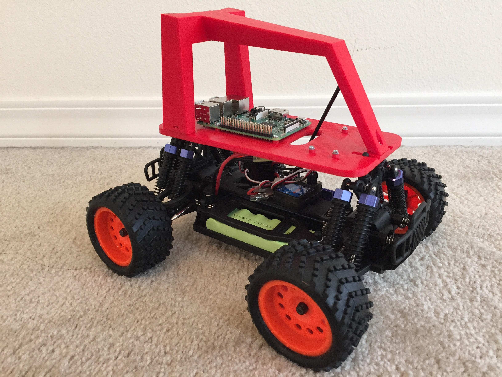

# Sparky: Hobby Raspberry Pi based self driving race car. 

Sparky is a 3D printed model car driven by a Raspberry Pi. It runs code derived from the excellent Donkey self car project by wroscoe and others. My goals with Sparky are:

* Learn about 3D printing, Neural Networks, Keras, CNTK, Tensorflow, Docker, Python, Github etc.
* Get my hands dirty with building something tangible, experiment and have fun!
* Contribute improvements back to the community as I find time

Many thanks to @wroscoe, @alanwells and others in the community!

